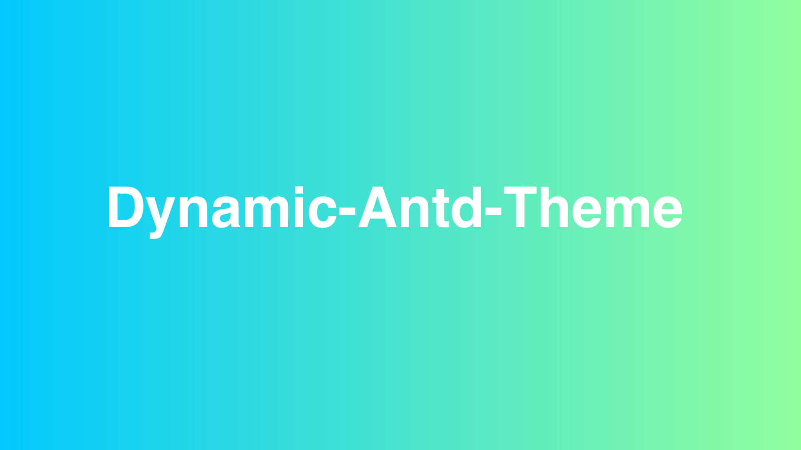
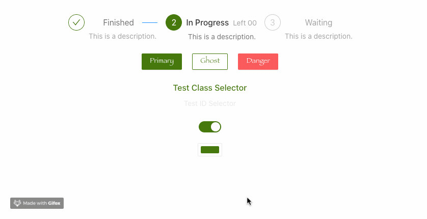

[](https://dynamic-antd-theme-luffyzh.vercel.app/)


A simple plugin to dynamic change [ant-design](https://ant.design) theme whether less or css. 

English | [简体中文](./README_zh_CN.md)

> After gzip: 42.7kB

**This project was initially targeted at 'ant-design', that means it's used in the React project. However, the core style was also applicable to 'ant-design-vue' || 'ant-design-angular'. In addition, for the convenience of one-key and auto use, the color-picker was also packaged into the project, resulting in too large a volume of the project. Aiming at this problem, I develope a new minor version —— [mini-dynamic-antd-theme](https://github.com/luffyZh/mini-dynamic-antd-theme).**

## 🏠 HomePage
[Dynamic-Antd-Theme-Demo](https://dynamic-antd-theme.luffyzh.now.sh/)

## 🌍 Browser Support

|  |  |  |  |  |
| --- | --- | --- | --- | --- |
| Chrome 39.0+ ✔ | Edge 12.0+ ✔ | Firefox 30.0+ ✔ | IE 11+ ✔ | Safari 9.1+ ✔ |

## 📦 Install

`npm install dynamic-antd-theme` or `yarn add dynamic-antd-theme`


## 🔨 Usage

The best usage of the dynamic-antd-theme is in the common compnent (Layout/Header etc...) of your application.

```
// Layout.js
...
import DynamicAntdTheme from 'dynamic-antd-theme';
...

<div className='theme-container'>
  <span>Change antd theme: </span>
  <DynamicAntdTheme />
</div>

```

## ✨ Props

| Props       | Type   | Default                  | Description         |
| ---------- | ------ | --------------------- | ------------ |
| primaryColor   | String | #1890d5 |  your antd initial @primary-color      |
| storageName   | String |   custom-antd-primary-color  | the name that is saved in the localStorage    |
| style   | Object |  null  | you can custom the component style simply  |
| placement   | String | bottomRight |  change the color-picker position, `bottom, bottomRight, right, topRight, top, topLeft, left, bottomLeft`|
| themeChangeCallback   | Func | null | you can do something use themeColor when themeColor changed. |
| customCss   | String | '' | you can define custom css effect any element. |
| cascadeLayer   | String | undefined | cascade layer to wrap generated css (see [MDN](https://developer.mozilla.org/en-US/docs/Web/CSS/@layer) for more information on cascade layers). |

### How to use the primaryColors in customCss?

You can do this using the following four variables（just like scss）：

 - $primary-color
 - $primary-hover-color
 - $primary-active-color
 - $primary-shadow-color

```
const customCss = `
  .ant-btn {
    font-family: fantasy;
  }
  .custom-title {
    color: $primary-color;
  }
  .custom-title:hover {
    color: $primary-hover-color;
    cursor: pointer;
  }
  #custom-id {
    color: $primary-shadow-color;
  }
`;
```

## 🌞 Export
| export       | Description         |
| ---------- | ------------ |
| default  | The <DynamicAntdTheme /> component   |
| changeAntdTheme   | `param: (color, options)`, change the antd theme. The options specific attributes are as follows： - `storageName`: This can be configured to set storageName when not using picker. - `customCss`: custom Css. - `cascadeLayer`: specify a cascade layer for the generated css. |

## 🌰 More Example

### Basic Use

```

<DynamicAntdTheme primaryColor='#77dd66' />

<DynamicAntdTheme storageName='my-custom-define-color' />

<DynamicAntdTheme style={{ display: 'margin: 10px' }} />

function themeChangeCallback (color) {
  document.getElementById('my-header-bar').style.backgroundColor = color;
}

<DynamicAntdTheme themeChangeCallback={this.themeChangeCallback} />

```

### Define Custom CSS
```
// define custom css
const customCss = `
  .ant-btn {
    font-family: fantasy;
  }
  .custom-title {
    color: $primary-color;
  }
  .custom-title:hover {
    color: $primary-hover-color;
    cursor: pointer;
  }
  #custom-id {
    color: $primary-shadow-color;
  }
`;

<DynamicAntdTheme
  customCss={customCss}
/>

```
The effects as flow:



### No Color-Picker

> If u don't need the `color-picker`，[mini-dynamic-antd-theme](https://github.com/luffyZh/mini-dynamic-antd-theme) is more suitable for you.

```
import { generateThemeColor, changeAntdTheme } from 'dynamic-antd-theme';
...

<Button
  onClick={
    () => {
      const color = 'blue';
      changeAntdTheme(color);
    }
  }
>Change Theme</Button>
```

## ⚠️ Attention

**This solution is easy to use, so it is prone to problems. We hope you can give us timely feedback. For example, if there is a problem with any component, we will fix the updated version as soon as possible.**

 - The current version requires your antd version to be lower than v3.19.0
   
> The antd version is higher than v3.19.0 you can also use it, if have some problems remember give me an issue. 

 - ...Plugin versions are updated from time to time based on antd (new antd components are updated)

## 🔗 Changelogs
[CHANGELOG](./docs/CHANGELOG.md)

## 🍎 Follow-Up Plan
 
 - More custom type: `border-color`, `border-radius`, etc.

> If you're interested in this repository, Fork/PR/Issue all are welcome.

